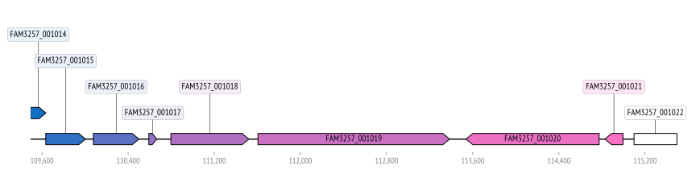
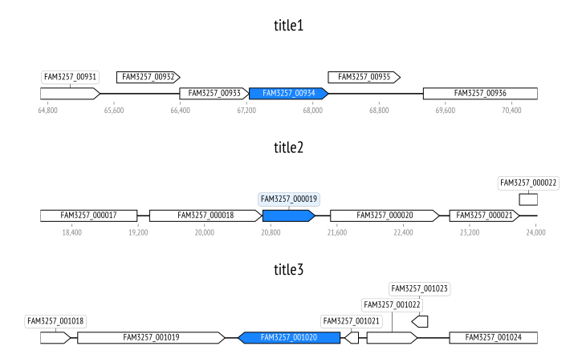
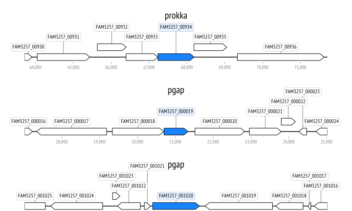
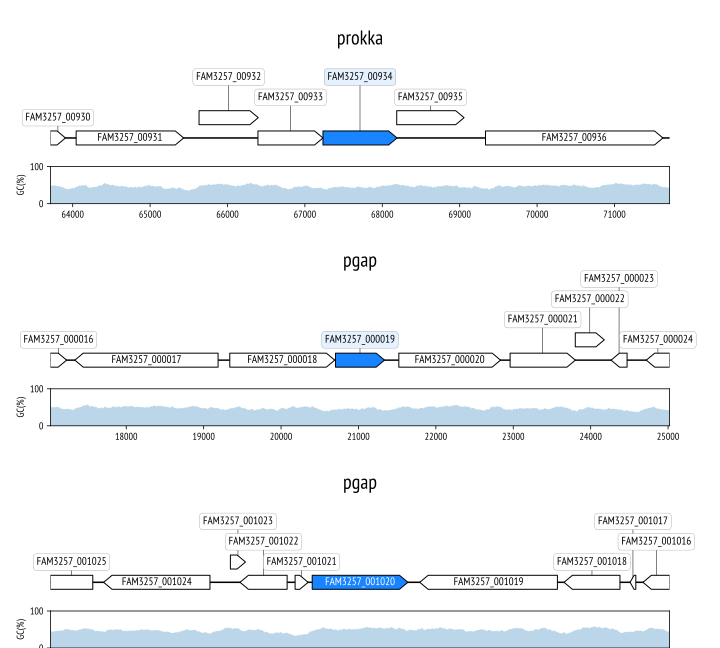

# Gene Loci Comparison

Create fancy (bokeh) gene locus plots from GenBank files!

This repository extends the functionality of the excellent [DnaFeaturesViewer](https://edinburgh-genome-foundry.github.io/DnaFeaturesViewer/)

## Setup

```shell
pip install git+https://github.com/MrTomRod/gene_loci_comparison.git
```

## Examples

### Bokeh

This library can also create interactive html/javascript-based plots. Open these files in your browser:

- [single locus](tests/output/locus/test_single_locus_pgap.html)
- [multiple loci with synchronized panning](tests/output/loci/test_multiple_bokeh.html)

### Single locus, specify colors

```python
from gene_loci_comparison import Locus, Loci
import matplotlib
import matplotlib.pyplot as plt

matplotlib.rcParams['font.family'] = "PT Sans Narrow"

locus = Locus(gbk_file='/path/to/file.gbk', locus_tag='FAM3257_001019')

locus_to_color = dict(
    FAM3257_001014='#1271c3',
    FAM3257_001015='#3171c3',
    FAM3257_001016='#5d71c3',
    FAM3257_001017='#9371c3',
    FAM3257_001018='#b171c3',
    FAM3257_001019='#cb71c3',
    FAM3257_001020='#ea71c3',
    FAM3257_001021='#fd71c3',
    # FAM3257_001021='#fd71c3'  # last gene: white (default color)
)

locus.colorize(locus_to_color)

ax, _ = locus.plot(figure_width=12)

plt.show()
```



### Multiple loci

```python
from gene_loci_comparison import Loci
import matplotlib

matplotlib.rcParams['font.family'] = "PT Sans Narrow"

# Each locus is made from a gbk-file, a gene identifier and a title (optional)
loci_of_interest = [
    dict(gbk='/path/to/file1.gbk', gene='FAM3257_00934', title='title1'),
    dict(gbk='/path/to/file2.gbk', gene='FAM3257_000019', title='title2'),
    dict(gbk='/path/to/file3.gbk', gene='FAM3257_001020', title='title3'),
]

# Highlight selected genes
locus_to_color_dict = {locus['gene']: '#1984ff' for locus in loci_of_interest}

# Generate loci object
loci = Loci.generate(
    loci_of_interest,
    locus_to_color_dict=locus_to_color_dict
)

plot = loci.plot(auto_reverse=False)

plot.show()
```



### Multiple loci, autoreversed

To automatically reverse loci based on the direction of the selected genes. Simply set `auto_reverse` to `True`.



### Multiple loci, with GC content

Change plotting method from `plot_multiple` to `plot_multiple_gc`.

```python
plot = loci.plot_gc(
    auto_reverse=True,
    window_bp=200
)

```


